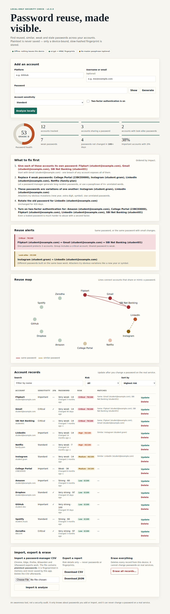

# Smart Password Reuse Risk Analyzer  (v2.0)

A **local-only** web app that finds password **reuse**, **look-alike variants**, **weak** and **stale** passwords across the accounts you enter, and tells you what to fix first. Passwords are never saved: only a device-bound **scrypt + HMAC-SHA-256 fingerprint** is stored.



## What it does

| Capability | How |
|---|---|
| Exact reuse detection | Equal fingerprints across accounts, grouped and scored |
| **Look-alike detection** (`Summer2023!` vs `Summer2024!`) | Second fingerprint of the password's "skeleton" (digits/symbols stripped, leet-speak undone) |
| **Strength estimate** | Offline estimator: common list, keyboard walks, repeats, years, "Word+digits+symbol" patterns |
| **Explainable risk score** | Every score is a sum of named factors you can expand in the table |
| **Password health score** (0-100, A-F) | Aggregate of all account risks |
| Prioritised "what to fix first" list | Breaches > critical reuse > weak > look-alike > old > no 2FA |
| Reuse map | SVG graph: solid line = same password, dashed = look-alike |
| Live feedback while typing | Strength meter + "already used for ..." (nothing stored, no network) |
| Rotate / update records | Replace a password after you change it for real; age resets |
| Several accounts per platform | Unique on *(platform, username)* |
| CSV import | Chrome / Edge / Firefox / Bitwarden / 1Password exports, processed in memory only |
| Export report | CSV / JSON with risk details only, never passwords or fingerprints |
| Password generator | In the browser with `crypto.getRandomValues` |
| Optional breach check | HIBP k-anonymity (only a 5-char hash prefix is sent). **Off by default** |
| Old data kept | v1 databases migrate automatically (with a backup) |

## Run

**Windows (PowerShell)**
```powershell
py -m venv .venv
.\.venv\Scripts\Activate.ps1
pip install -r requirements.txt
python app.py
```
**macOS / Linux**
```bash
python3 -m venv .venv && source .venv/bin/activate
pip install -r requirements.txt
python app.py
```
Open <http://127.0.0.1:5000>. Try `python app.py --demo` for a pre-filled sample dataset (separate demo files, safe for screenshots).

The server refuses to bind a non-loopback address unless you pass `--allow-remote` (the app has no login).

## Configuration (environment variables)

| Variable | Default | Meaning |
|---|---|---|
| `PRA_BREACH_CHECK` | off | `1` enables the HIBP range lookup (the **only** network feature) |
| `PRA_MASTER_PASSPHRASE` | none | Extra secret mixed into the fingerprint key; never written to disk. Losing it makes existing fingerprints unusable |
| `PRA_WORDLIST` | none | Path to an extra common-password list (one per line) |
| `PRA_SCRYPT_LOG_N` | 14 | scrypt cost (2^N). Higher = slower and safer |
| `PRA_STALE_DAYS` / `PRA_VERY_STALE_DAYS` | 180 / 365 | Age thresholds for "old password" |

## How the risk score works

```
Exact-reuse group :  25 + 15 x (accounts - 2)  + sensitivity (0/10/20)  [+10 weak] [+15 breached] [+5 >1 year]  [-10 if 2FA on all]
Single account    :  breached 40 | common 35 | variant of common 25 | very weak 20 | weak 14 | fair 6
                     + look-alike 15..25 + old 5..10 ; then + sensitivity/2 and -10 for 2FA (only if already risky)
Levels            :  Low < 20 <= Medium < 45 <= High < 70 <= Critical
```
The original v1 formula is preserved for plain reuse groups; everything else is additive.

## Project layout

```
app.py                 Flask app factory, routes, CLI
analyzer.py            backwards-compatible import shim
reuse_analyzer/        config, crypto (fingerprints), database (+migration), strength,
                       similarity, scoring, breach, importer, service, security, demo
templates/ static/     UI (no CDN, no inline JS/CSS: strict Content-Security-Policy)
tests/                 80 unit/API tests  (+ optional browser smoke test)
docs/                  IMPROVEMENTS.md, SECURITY.md, PPT_ALIGNMENT.md, screenshots
```

## Tests

```bash
python -m unittest discover -v          # 80 tests, < 1 s
python tests/e2e_ui_smoke.py            # optional, needs: pip install playwright && playwright install chromium
```

## Limits (please read)

* It only knows about passwords you add/import and cannot change passwords on real services.
* Python cannot wipe a string from RAM, so the claim is *"never written to disk, logs or responses"*, not *"never in memory"*.
* The strength estimator is a transparent heuristic, not a full zxcvbn.
* If someone steals **both** `instance/fingerprint.key` **and** the database they can run (slow, scrypt-limited) guesses. Set `PRA_MASTER_PASSPHRASE` and use full-disk encryption. See `docs/SECURITY.md`.
* Back up `instance/fingerprint.key` together with the database: without the key the fingerprints can't be compared.
